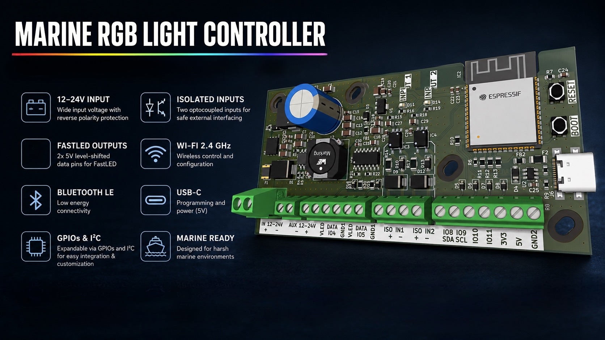

<p align="center">
    
</p>

<h1 align="center">
Marine RGB Light Controller
</h1>

<p align="center">
ESP32-S3 based RGB LED controller for marine, automotive and industrial lighting applications.
</p>

<p align="center">


</p>

---

# Overview

The Marine RGB Light Controller is a custom ESP32-S3 development board designed for controlling addressable LED installations in demanding environments.

Unlike a standard ESP32 development board, it integrates a protected controller power supply, dual 5V logic LED data outputs, high-speed optically isolated digital inputs and multiple expansion interfaces on a single compact PCB.

Originally developed for marine lighting systems, the controller is equally suitable for automotive, off-road and industrial applications.

---

# Highlights

- ⚡ Protected 12–24V DC controller power input
- 🔋 Direct VIN pass-through LED power output (12–24V)
- 🌈 Two independent 5V level-shifted LED data outputs
- 🔀 Compatible with a wide range of digital LED chipsets
- 🛡 Reverse polarity and surge protection for controller electronics
- 🔌 USB-C programming
- 🔒 Two high-speed optically isolated digital inputs
- 📡 Wi-Fi & Bluetooth
- 🔧 GPIO & I²C expansion
- ⚓ Designed for harsh electrical environments

---

# Hardware Overview

<p align="center">

</p>

The controller integrates everything required for reliable LED control on a single PCB:

- Protected controller power input
- High-efficiency buck converter
- Dedicated 3.3V LDO regulator
- ESP32-S3-WROOM-1-N8R8
- USB-C programming interface
- Dual 5V logic level shifters
- High-speed optocouplers
- GPIO & I²C expansion header

> [!IMPORTANT]
> **LED VOUT is a direct pass-through of the input supply.**
>
> - LED VOUT voltage is always equal to VIN.
> - The LED supply path is **not reverse polarity protected**.
> - The LED supply path is **not separately fused**.
> - Only the controller electronics are protected by the onboard fuse and reverse polarity protection.
> - External protection should be added where required by the application.

---

# Pinout

<p align="center">

</p>

| Interface | Description |
|------------|-------------|
| VIN | 12–24V DC Input |
| AUX Power | Direct VIN pass-through |
| DATA 1 | 5V Logic LED Data Output |
| DATA 2 | 5V Logic LED Data Output |
| ISO Input 1 | Optically Isolated Input |
| ISO Input 2 | Optically Isolated Input |
| SDA / SCL | I²C Expansion |
| IO10 / IO11 | GPIO Expansion |
| 3V3 / 5V | Auxiliary Power Outputs |

---

# Gallery

<p align="center">


</p>

---

# Technical Specifications

| Feature | Specification |
|---------|---------------|
| MCU | ESP32-S3-WROOM-1-N8R8 |
| Input Voltage | 12–24V DC |
| Controller Supply | Protected (Fuse + Reverse Polarity + TVS) |
| LED Supply Output | Direct VIN Pass-through |
| LED Data Outputs | 2 × 5V Logic (Level Shifted) |
| Optically Isolated Inputs | 2 |
| USB | USB-C |
| Wireless | Wi-Fi + Bluetooth |
| Expansion | GPIO + I²C |

---

# Repository Structure

```text
docs/
├── images/
├── hardware.md
├── software.md

firmware/

hardware/

README.md
```

---

# Documentation

Additional documentation is available in the **docs** directory.

- Hardware Design
- Power Supply
- LED Outputs
- Optocoupled Inputs
- Software
- Getting Started

---

# Project Status

| Hardware | Firmware | Documentation |
|----------|----------|---------------|
| ✅ Stable | 🚧 In Development | 🚧 In Progress |

---

# Future Development

- Modern web interface
- OTA firmware updates
- MQTT support
- Home Assistant integration
- Additional LED effects
- Configuration backup & restore

---

# License

Released under the MIT License.

---

<p align="center">

Designed and developed by <strong>Watcher-33</strong>

</p>
