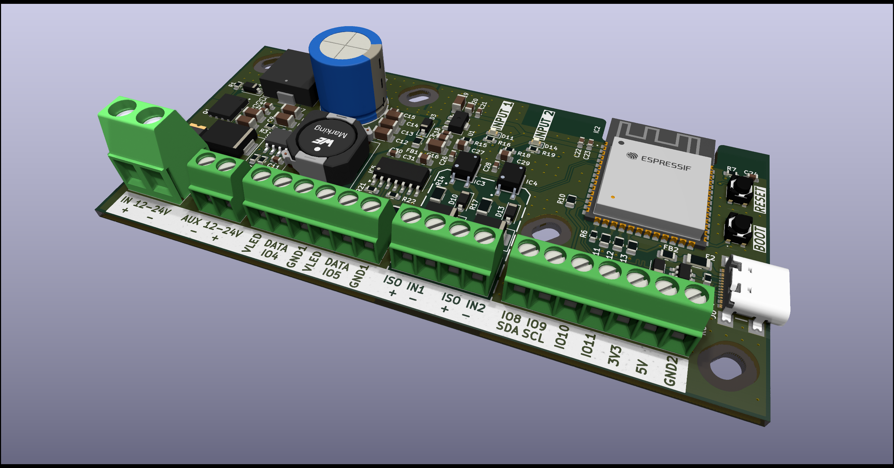
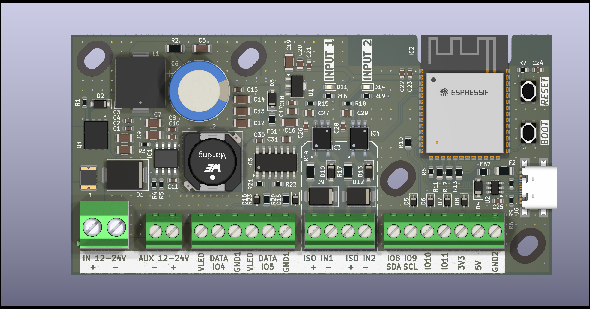
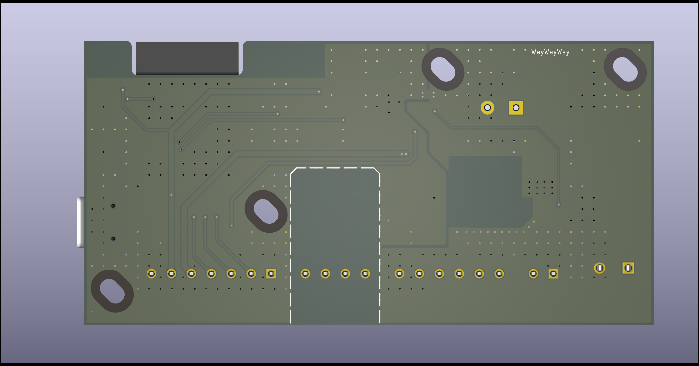
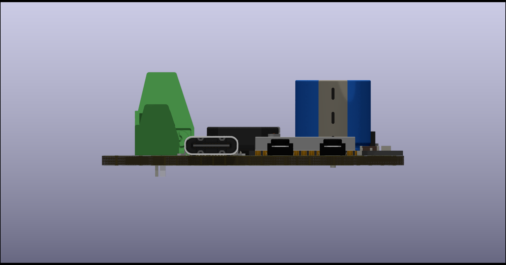
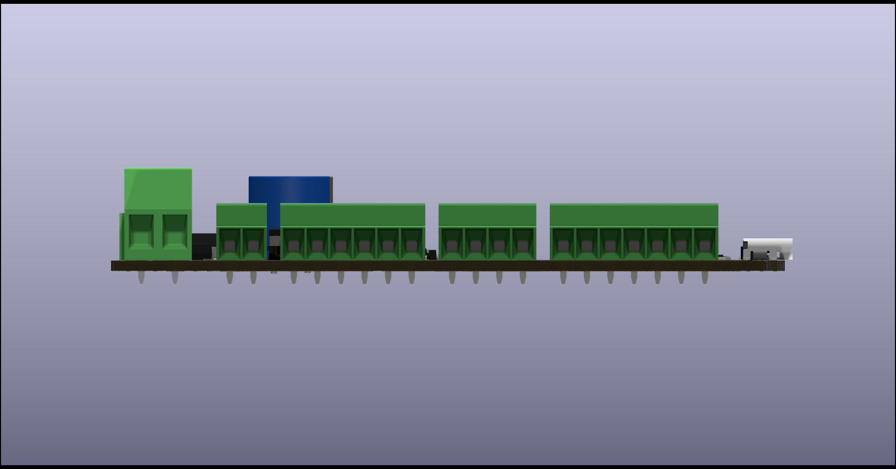

<p align="center">
  
</p>

# Marine RGB Light Controller

A professional ESP32-S3 based RGB lighting controller designed for marine environments.

Built for reliability, expandability and seamless integration with FastLED, while providing isolated inputs, wireless connectivity and a robust 12–24V power architecture.

---

## Features

- ESP32-S3-WROOM-1
- 12–24V DC input
- Reverse polarity protection
- 2× opto-isolated digital inputs
- 2× 5V level-shifted FastLED data outputs
- USB-C programming & power
- Wi-Fi 2.4 GHz
- Bluetooth LE
- GPIO expansion
- I²C expansion
- Designed for marine environments

---

# Hardware Overview

| Feature | Description |
|----------|-------------|
| MCU | ESP32-S3-WROOM-1 |
| Supply Voltage | 12–24V DC |
| LED Outputs | 2 × 5V Level Shifted FastLED Outputs |
| Digital Inputs | 2 × Opto-Isolated Inputs |
| Wireless | Wi-Fi 2.4GHz + Bluetooth LE |
| Expansion | GPIO + I²C |
| USB | USB-C |
| Protection | Reverse polarity protection |

---

# Gallery

<p align="center">



<br><br>



<br><br>



<br><br>



<br><br>



</p>

---

# Technical Specifications

| Parameter | Value |
|-----------|-------|
| MCU | ESP32-S3-WROOM-1 |
| Flash | 8 MB |
| PSRAM | 8 MB |
| Input Voltage | 12–24V DC |
| USB | USB-C |
| Wi-Fi | 2.4 GHz |
| Bluetooth | BLE |
| Isolated Inputs | 2 |
| FastLED Outputs | 2 |
| GPIO Expansion | Yes |
| I²C Expansion | Yes |

---

# Repository Structure

```
Marine-RGB-Light-Controller
│
├── docs
│   └── images
│
├── firmware
│
├── hardware
│
├── LICENSE
│
└── README.md
```

---

# Future Improvements

- OTA firmware updates
- Web configuration interface
- Home Assistant integration
- Additional FastLED effects
- CAN bus support

---

# License

Released under the MIT License.
